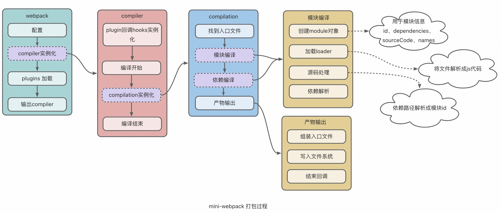

# mini-webpack
webpack最简打包过程
## 笔记
### 环境配置
#### 依赖
1. 装webpack和webpack-cli
   `npm install webpack webpack-cli -g`
#### 配置
1. 配置webpack.config.js文件
```js
module.exports = {
  // 入口文件
  entry: path.join(__dirname, '/src/entry.js'),
  // 编译后的文件
  output: {
    path: path.join(__dirname, '/dist'),
    filename: 'bundle.js'
  }
}
```
2. 配置快速指令
```json
{
  "script": {
    "build": "webpack"
  }
}
```
上述配置后可以执行`npm run build`指令，将入口文件编译到出口文件中，可以手动创建一个HTML文件去查验编译结果，HTML文件内容如下：
```html
<html lang="en">
<head>
    <meta charset="UTF-8" />
    <title>Webpack Project</title>
</head>
<body>
<div id="root"></div>
<!--引入打包之后的js文件-->
<script type="text/javascript" src="bundle.js"></script>
</body>
</html>
```

### 创建开发服务
#### 依赖
`npm install webpack-dev-server webpack-cli webpack -D`
#### 配置
1. 配置webpack.config.js
```js
module.exports = {
  // 其余省略
  devServer: {
    allowedHosts: 'all', // 'auto' | 'all' [string]，该选项允许将允许访问开发服务器的服务列入白名单
    client: {
    	progress: true, // 在浏览器中以百分比显示编译进度。
    },
    // watchFiles: ['dist/**/*'], // 监听变更 不需要指定，默认会开启全局监听
    static: {
      directory: path.join(__dirname, 'dist'), // 指定要提供静态文件的目录
    },
    port: '8088', // 设置端口号为8088
      historyApiFallback: true, //不跳转
    }
}
```
2. 配置快速指令
```json
{
  "script": {
    "start": "webpack-dev-server --open"
  }
}
```
#### loader
由于webpack只能识别JavaScript和json，所以需要引入loader模块来将webpack不认识的文件转译成webpack认识的函数体，再由webpack完成编译工作。
创建模块时，匹配请求的规则数组。这些规则能够修改模块的创建方式。 这些规则能够对模块(module)应用 loader，或者修改解析器(parser)
##### 配置项
a. test：一个用以匹配 loaders 所处理文件的拓展名的正则表达式（必须）
b. use：loaderArray，还有其他写法如loader（必须）
c. include/exclude：手动添加必须处理的文件（文件夹）或屏蔽不需要处理的文件（文件夹）（可选）；
d. options：为 loaders 提供额外的设置选项（可选）
##### 示例
```js
module.exports = {
  module: {
    rules: [
        {
            test: /\.css$/,
            use: ['css-loader', 'style-loader'] // css-loader：加载.css 文件,style-loader：使用 style 标签将 css-loader 内部样式注入到我们的 HTML 页面
        },
      	{
            test: /\.(png | jpe?g | gif | svg)(\?.*)?$/,
            loader: 'url-loader',
            options: {
              limit: 10000, // 单位B，大小小于等于此值的图片会使用url-loader解析成base64
              name: path.resolve('dist', 'img/[name].[hash:7].[ext]') // 解析出来的文件放置路径，name标识原文件名，hash:7标识取hash值前7位，ext标识文件扩展名
            }
          }
      ]
  }
}
```
#### 常见的loader
1. css 
   1. css-loader：加载css文件 
   2. style-loader：将编译后的css以style标签的形式插入HTML文件
2. sass 
   1. sass-loader：加载.sass | .scss文件
3. JavaScript 
   1. babel-loader：可以让你能使用最新的 JavaScript 代码（ES6，ES7...）；让你能使用基于 JavaScript 进行了拓展的语言，比如 React 的 JSX；
4. 图片 
   1. url-loader: 处理图片资源时，我们常用的两种 loader 是 file-loader 或者 url-loader。 当使用 url-loader 加载图片，图片小于上限值，则将图片转 base64 字符串，否则使用 file-loader 加载图片
### plugins
编译过程中存在很多不同阶段的hook，如：编译开始、结束等，插件就是通过hook介入到编译过程中，以达到自定义构建过程的效果。
webpack 附带了各种内置插件，可以通过 webpack.[plugin-name] 访问这些插件。常见的插件有：
1. html-webpack-plugin
   1. 将生成的bundle文件自动插入到HTML文件中。 
   2. 上述例子中，我们是手动引入`bundle.js`文件到HTML文件中，如果说有多个入口js文件，每次都去手动修改HTML文件会很麻烦，可以用这个插件来解决。
2. clean-webpack-plugin 
   1. 自动清理指定文件夹
### 原理
webpack本质上是个函数，传入配置参数webpack.config.js，返回一个compiler对象，该对象有个run函数，执行run函数即可执行编译，可以给run函数传入一个回调函数，获取执行结果和执行进程。
```js
const webpack = require('webpack');
const options = require('./webpack.config.js');
const compiler = webpack(options);
const processCb = (err, stat) => {
  console.log('errInfo:', err);
  console.log('statInfo', stat.toJson({
    assets: true, //打印本次编译产出的资源
    chunks: true, //打印本次编译产出的代码块
    modules: true, //打印本次编译产出的模块
  }));
}
compiler.run(processCb);
```
#### 编译产物
1. 模块存储
2. 模块缓存
3. 入口文件源码（已替换模块）
4. 产物自执行
#### 核心思想
1. 根据`webpack.config.js`的`entry`找到入口文件
2. 找到入口文件的依赖信息，如路径、依赖、源码等
```js
var module = [
  {
    path: './src/entry.js',
    depencies: ['./src/js/hello.js'],
    source: 'const hello = require("./src/js/hello.js")' + 'console.log(hello)',
  },
  {
    path: './src/js/hello.js',
    depencies: [],
    source: 'module.exports = "我是hello.js"'
  }
];
```
3. 根据上述信息生成最终输出的内容，如上述编译产物所示。   

由于浏览器只能识别HTML、js和css，其他的文件就需要对源文件进行转换，执行该功能的系统称为loader系统。  

除此以外，在打包的过程中也需要在某些特定时机中进行一些处理，如：打包前清空目标文件目录，编译后把结果插入到HTML文件中等，所以需要Plugin系统，方便社区进行扩展。Plugin系统本质上就是一种事件流的机制，到了固定的时间节点就广播特定的事件，用户可以在事件内执行特定的逻辑，类似于生命周期：打包前->打包中->打包后（成功 or 失败）。   

webpack使用`Tapable`进行事件注册和触发。
```js
// hook实例化
const { SyncHook } = require('tapable');
const hook = new SyncHook([name, age]);

// 注册事件
hook.tap('监听器1', (name, age) => {
  console.log('监听器1被触发', name, age);
})

hook.tap('监听器2', (name) => {
  console.log('监听器2被触发', name);
})

// 触发
hook.call('张三', 20);

// 结果
// 监听器1被触发, 张三, 20
// 监听器2被触发, 张三
```
### 实现mini-webpack
#### 工作流程
##### 简介
webpack实际上是个函数，配置是它的输入，返回compiler对象，执行compiler.run()函数即可开始根据配置进行编译，run函数可以输入一个回调函数，用来查看编译进程。可以通过以下两种方式调用webpack来进行打包：
1. bin指令：webpack 
2. 代码调用：
```js
const { webpack } = require('webpack');
const options = require('./webpack.config.js');
const compiler = webpack(options);
const callback = (err, stat) => {
  console.log('error', err);
  console.log('stat', stat.toJson());
}
compiler.run(callback);
```
#### 整体工作流程

#### 详解
我们将通过创建mini-webpack来详细介绍上述工作流程。
##### 1. 项目初始化
1. 初始化
`npm init`
2. 依赖
`webpack`
3. 项目结构
[pic]
4. 源码
```js
// 入口文件 ./src/index.js 
const sayHello = require('./js/sayHi');
console.log(sayHello);
```
```js
// 被入口文件依赖的文件  ./src/js/sayHi.js
const tips = require('./hello');
module.exports = `say ${tips}`;
```
```js
// 被 sayHi 文件依赖的文件 ./src/js/hello.js
const tips = '你好';
module.exports = tips;
```
5. 配置
```js
// webpack.config.js
const path = require('path');
module.exports = {
    mode: 'development', // 防止被压缩
    entry: path.join(__dirname, '/src/index.js'),
    output: {
        path: path.join(__dirname, 'dist'),
        filename: '[name].js',
    },
    devtool: "source-map", //防止干扰源文件
}
```

6. 调试文件
仿照上述代码调用webpack的方式，重写调试文件
```js
// debugger.js
const { webpack } = require('./webpack'); // 调用 mini-webpack
const options = require('./webpack.config.js');
const compiler = webpack(options);
const callback = (err, stat) => {
  console.log('error', err);
  console.log('stat', stat.toJson());
}
compiler.run(callback);
```
##### 2. 搭建架构
根据`debugger.js`可以看出，webpack本质上是个函数，返回是个`compiler`对象，所以mini-webpack的结构如下：
```js
// mini-webpack.js
class Compiler {
    constructor() {
    }

    run(callback) {

    }
}

const webpack = (webpackOptions) => {
    const compiler = new Compiler();
    return compiler;
}

module.exports = {
    webpack
}
```

##### 3.compiler初始化
将配置参数传递到compiler中，以便做后续的编译工作，同时对外提供hook，方便外部干预编译过程。上面说过，webpack使用Tapable来实现事件的创建、注册和触发，hook就是事件的创建，由使用它的plugin来注册，再由compiler在适当的时机去触发事件。

所以，需要先安装依赖`tapable`，再对mini-webpack进行以下改造：
```diff
// mini-webpack.js
+ const { SyncHook } = require('tapable');

class Compiler {
    constructor(webpackOptions) {
+        this.options = webpackOptions;
+        this.hooks = {
+            run: new SyncHook(),
+            done: new SyncHook(),
        }
    }

    run(callback) {

    }
}

const webpack = (webpackOptions) => {
+    const compiler = new Compiler(webpackOptions);
    return compiler;
}

module.exports = {
    webpack
}

```

##### 4. 加载plugin
plugin实际上是一个实例，里面提供了一个apply方法，接收compiler实例作为入参，可介入到编译的过程中。
我们首先创建两个plugin：
```js
// myPlugins.js
class StartPlugin {
  apply(compiler) {
      compiler.hooks.run.tap('start', () => {
        console.log('编译开始啦！');
      })
  }
}

class EndPlugin {
  apply(compiler) {
    compiler.hooks.done.tap('end', () => {
        console.log('编译结束啦！');
    })
  }
}
module.exports = {
  StartPlugin,
  EndPlugin
}
```

然后将plugin配置到webpack.config.js中：
```diff
// mini-webpack.js
const path = require('path');
+ const {StartPlugin, EndPlugin} = require("./myPlugins");

module.exports = {
  mode: 'development', // 防止被压缩
  entry: path.join(__dirname, '/src/index.js'),
  output: {
  path: path.join(__dirname, 'dist'),
  filename: '[name].js',
  },
  devtool: "source-map", //防止干扰源文件
+    plugins: [
+        new StartPlugin(),
+        new EndPlugin(),
+    ]
}
```

最后在mini-webpack中完成plugin加载：
```diff
// 其余部分省略
const webpack = (webpackOptions) => {
    const compiler = new Compiler(webpackOptions);
+    webpackOptions.plugins.forEach(plugin => {
+        plugin.apply(compiler);
+    })
    return compiler;
}
```
##### 5. hook触发
将`run`和`donehook`注册到编译过程中
```diff
+ const { SyncHook } = require('tapable');
// 其余忽略
class Compiler {
    constructor(webpackOptions) {
        this.options = webpackOptions;
        this.hooks = {
            run: new SyncHook(),
            done: new SyncHook(),
        }
    }
    
+    compile(callback) {}

    run(callback) {
+        this.hooks.run.call();
+       const compileDone = () => {
+            this.hooks.done.call();
+        }
+        this.compile(compileDone);
    }
}
```
##### 6. 编译
  编译包含以下几个步骤：
  ① 找到入口文件
  ② 遍历入口文件，开始编译模块
  ③ 组装依赖产物，并写入到文件系统中 
  ###### 6.1 找入口文件
```diff
// mini-webpack.js
// 其余忽略
+class Compilation {
+    constructor(webpackOptions) {
+        this.options = webpackOptions;
+    }
+    build(callback) {
+        let entry = {}; // 存储入口文件列表
+        if (typeof this.options.entry === 'string') {
+            entry.main = this.options.entry; // 保持数据格式一致，便于处理
+        } else {
+            entry = this.options.entry;
+        }
+    }
+}

class Compiler {
    compile(callback) {
+        const compilation = new Compilation(this.options); // 便于重复编译
+        compilation.build(callback);
    }
}
```

###### 6.2 模块编译
模块编译包括以下几个过程：
1. 创建module对象，用于存储编译产物 
2. 匹配loader规则，使用loader对文件内容进行转换 
3. 将源码中的依赖路径改为对模块id的依赖，并将源码存储到module对象中 
4. 将源码中的依赖存储到module的依赖项中 
5. 遍历依赖项，对依赖的模块进行编译 
6. 返回模块

为了避免重复编译和方便数据管理，我们将编译过程中的产物均进行保留，分为以下几种： 
1. modules：已经编译完成的模块 
   1. id：模块id，其实就是模块相对于当前编译路径的相对路径 
   2. names：该模块的关联入口文件名，方便进行代码块组装（可能存在多个入口文件，所以是个数组） 
   3. dependencies：该模块的依赖模块，值为模块id数组 
   4. sourceCode：模块的源码
2. chunks：代码块，每个入口文件存为一个chunk 
   1. name：入口文件名 
   2. sourceCode：入口文件的源码 
   3. relativeModules：入口文件的依赖模块，可以根据names聚合 
3. assets：产物，存储产物名称及其对应的内容，用于追踪产物 
   1. 类型为：{[filePath: string]: string;}[]
4. fileDependencies：本次编译涉及到的所有文件路径（绝对路径），便于实现watch模式，即对这些文件进行监听，当文件发生变更时，重新编译 
   1. fs.watch(filePath)

下面我们先创建模块编译架构：
```diff
class Compilation {
    constructor(webpackOptions) {
        this.options = webpackOptions;
    }

+    buildModule(entryName, filePath) {
+
+    }

    build(callback) {
        let entry = {};
        if (typeof this.options.entry === 'string') {
            entry.main = this.options.entry; // 保持数据格式一致，便于处理
        } else {
            entry = this.options.entry;
        }
+        for (let entryName in entry) {
+            const module = this.buildModule(entryName, entry[entryName]);
+        }
    }
}
```
  ###### 6.2.1 创建module对象
```diff
+ const path = require("path");
class Compilation {
    constructor(webpackOptions) {
        this.options = webpackOptions;
    }

    buildModule(entryName, filePath) {
+        const module = {
+            id: path.posix.relative(baseDir, filePath),
+            names: [entryName],
+            dependencies: [],
+            sourceCode: ''
+        }
+        return module;
    }
}
```
  ###### 6.2.2 加载loader
  loader实际上是个函数，它负责将非js代码转换成js代码，以便构建AST语法树。下面我们先创建一个loader，并配置到webpack.config.js中，以便加载：
```js
// myLoader.js
const myLoader = (code) => {
    return `${code} // 自定义loader：增加注释\n`
}

module.exports = {
    myLoader
}
```
更新webpack.config.js配置：
```diff
+ const {myLoader} = require("./myLoader");

module.exports = {
+    module: {
+        rules: [
+            {
+                test: /\.js$/,
+                use: [myLoader]
+            }
+        ]
    }
}
```
使用loader对源码进行转换：
```diff
// mini-webpack.js
+ const fs = require("fs");

+ const baseDir = __dirname;

class Compilation {
    constructor(webpackOptions) {
        this.options = webpackOptions;
    }

+    loader(absoluteFilePath) {
+        let sourceCode = fs.readFileSync(absoluteFilePath, 'utf8');
+        const rules = this.options.module?.rules ?? [];
+        const loaders = rules.find(rule => {
+            const { test } = rule;
+            return absoluteFilePath.match(test)
+        }).use ?? [];
+        sourceCode = loaders.reduceRight((code, loader) => {
+            return loader(code);
+        }, sourceCode);
+        return sourceCode;
+    }

    buildModule(entryName, absoluteFilePath) {
        const module = {
            id: path.posix.relative(baseDir, absoluteFilePath),
            names: [entryName],
            dependencies: [],
            sourceCode: ''
        }
+        const codeAfterLoader = this.loader(absoluteFilePath);

        return module;
    }
}
```
  ###### 6.2.3 解析源码
  对源码的解析，我们通常会先构建AST语法树（<https://astexplorer.net/>），使用到的工具有：
  1. @babel/parser：解析成语法树
  2. @babel/traverse：遍历语法树
  3. @babel/types：编辑语法树节点（可以不要）
  4. @babel/generator：语法树转换成js源码  

  通过上述过程，我们将源码文件解析成了module对象，以webpack.js所在的目录的相对路径作为模块的id，接下来将对源码进行解析，主要完成以下两个功能：
  
① 获取模块依赖

② 获取源码，并将依赖的模块路径改为模块id，即将`require([absolutePath])`改为`require([moduleId])`
```diff
// mini-webpack.js
+ const { parse } = require('@babel/parser');
+ const traverse = require('@babel/traverse').default;
+ const generate = require('@babel/generator').default;

+ // 找到存在的文件
+ const findFilePath = (filename, exts) => {
+    if (fs.existsSync(filename)) {
+        return filename;
+    }
+    const validExt = exts.find(ext => fs.existsSync(`${filename}${ext}`));
+    if (validExt) {
+        return `${filename}${validExt}`;
+    }
+    throw new Error(`${filename}不存在`);
+ }

class Compilation {
    constructor(webpackOptions) {
        this.options = webpackOptions;
    }

+    // 解析源码，获取依赖模块和替换后的源码
+    codeParser(code, modulePath) {
+        const dependencies = [];
+        const ast = parse(code, {
+            sourceType: 'module'
+        });
+				 const that = this;  
+        traverse(ast, {
+            CallExpression(nodePath) {
+                const { node } = nodePath;
+                // 找到require语句
+                if (node.callee.name === 'require') {
+                    const filePath = path.posix.join(path.posix.dirname(modulePath), node.arguments[0].value);
+                    const fileWithExt = findFilePath(filePath, that.options.extensions ?? ['.js']);
+                    node.arguments[0].value = path.posix.relative(baseDir, fileWithExt); // 用模块id来替换
+                    // 依赖存储
+                    dependencies.push(fileWithExt);
+                }
+            }
+        });
+        const { code: sourceCode } = generate(ast);
+        return {
+            dependencies,
+            sourceCode
+        }
+    }

    buildModule(entryName, absoluteFilePath) {
        const module = {
            id: path.posix.relative(baseDir, absoluteFilePath),
            names: [entryName],
            dependencies: [],
            sourceCode: ''
        }
        const codeAfterLoader = this.loader(absoluteFilePath);
+        const { dependencies, sourceCode } = this.codeParser(codeAfterLoader, absoluteFilePath);
+        module.dependencies.push(...dependencies);
+        module.sourceCode = sourceCode;
        return module;
    }
}
```
  ###### 6.2.4 解析模块依赖
  通过上述过程，已经完成了module对象的编译，但还需要继续对module对象所依赖的模块继续编译。
```diff
// mini-webpack.js
const { SyncHook } = require('tapable');
const path = require("path");
const fs = require("fs");
const { parse } = require('@babel/parser');
const traverse = require('@babel/traverse').default;
const generate = require('@babel/generator').default;

const baseDir = __dirname;

// 找到存在的文件
const findFilePath = (filename, exts) => {
    if (fs.existsSync(filename)) {
        return filename;
    }
    const validExt = exts.find(ext => fs.existsSync(`${filename}${ext}`));
    if (validExt) {
        return `${filename}${validExt}`;
    }
    throw new Error(`${filename}不存在`);
}

class Compilation {
    constructor(webpackOptions) {
        this.options = webpackOptions;
+        this.modules = []; // 存储已经编译的模块
    }

    buildModule(entryName, absoluteFilePath) {
        const module = {
            id: path.posix.relative(baseDir, absoluteFilePath),
            names: [entryName],
            dependencies: [],
            sourceCode: ''
        }
        const codeAfterLoader = this.loader(absoluteFilePath);
        const { dependencies, sourceCode } = this.codeParser(codeAfterLoader, absoluteFilePath);
        module.dependencies.push(...dependencies);
        module.sourceCode = sourceCode;
+       module.dependencies.forEach(depPath => {
+           const depId = path.posix.relative(baseDir, depPath);
+           const existModule = this.modules.find(m => m.id === depId);
+           if (existModule) {
+               existModule.names.push(entryName);
+           } else {
+               const depModule = this.buildModule(entryName, depPath);
+               this.modules.push(depModule);
+           }
+       })
        return module;
    }

    build(callback) {
        let entry = {};
        if (typeof this.options.entry === 'string') {
            entry.main = this.options.entry; // 保持数据格式一致，便于处理
        } else {
            entry = this.options.entry;
        }
        for (let entryName in entry) {
            const module = this.buildModule(entryName, entry[entryName]);
+            this.modules.push(module);
        }
    }
}
```
  至此，可得modules结果如下：
```js
[
  {
    id: 'src/js/hello.js',
    names: [ 'main' ],
    dependencies: [],
    sourceCode: '// 被 sayHi 文件依赖的文件\n' +
      "const tips = '你好';\n" +
      'module.exports = tips;\n' +
      '// 自定义loader：增加注释'
  },
  {
    id: 'src/js/sayHi.js',
    names: [ 'main' ],
    dependencies: [ '/Users/chenjz/code/cjz/cjzPlay/mini-webpack/src/js/hello.js' ],
    sourceCode: '// 被入口文件依赖的文件\n' +
      'const tips = require("src/js/hello.js");\n' +
      'module.exports = `say ${tips}`;\n' +
      '// 自定义loader：增加注释'
  },
  {
    id: 'src/index.js',
    names: [ 'main' ],
    dependencies: [ '/Users/chenjz/code/cjz/cjzPlay/mini-webpack/src/js/sayHi.js' ],
    sourceCode: '// 入口文件\n' +
      'const sayHello = require("src/js/sayHi.js");\n' +
      'console.log(sayHello);\n' +
      '// 自定义loader：增加注释'
  }
]
```
  ###### 6.2.5 代码块组装
  上述过程已经将相关源码解析成module对象，接下来将根据module对象的names字段，将相同入口的module对象组装成一个chunk便于后续组装产物。chunk的数据结构如下：
```ts
// chunk结构
{
  name: string; // 入口文件名称
  module: Module; // 入口文件的module对象
  relativeModules: Array<Module>; // 入口文件的关联模块
}
```
```diff
// mini-webpack.js
class Compilation {
    constructor(webpackOptions) {
        this.options = webpackOptions;
        this.modules = []; // 存储已经编译的模块
+        this.chunks = []; // 存储已经编译好的代码块
    }

+   createChunk(fileName, module) {
+        return {
+            name: fileName,
+            sourceCode: module.sourceCode,
+            relativeModules: this.modules.filter(m => m.names.includes(fileName))
+        }
+    }

    build(callback) {
        let entry = {};
        if (typeof this.options.entry === 'string') {
            entry.main = this.options.entry; // 保持数据格式一致，便于处理
        } else {
            entry = this.options.entry;
        }
        for (let entryName in entry) {
            const module = this.buildModule(entryName, entry[entryName]);
            this.modules.push(module);
+            const chunk = this.createChunk(entryName, module);
+            this.chunks.push(chunk);
        }
    }
}
```
  ###### 6.2.6 生成产物
  将上述产生的代码块写入到文件系统中。存储产物(asset)的数据结构为：
  ```ts
// asset数据结构
{
    [filePath: string]: string; // 文件名：文件内容
  }
```
```diff
// mini-webpack.js
+ const getAssetContent = (chunk) => {
+    return `
+        (() => {
+            var modules = {
+                ${chunk.relativeModules.map(m => `'${m.id}':(module) => { ${m.sourceCode} \n}`).join(',\n')}
+            };
+            var cache = {};
+            // 重写require函数
+            var require = (moduleId) => {
+                if (cache[moduleId]) {
+                    return cache[moduleId].exports;
+                }
+                cache[moduleId] = {
+                    exports: {}
+                };
+                var module = cache[moduleId];
+                modules[moduleId](module);
+                return module.exports;
+            };
+			 // 入口文件源码
+            ${chunk.module.sourceCode}
+        })() // 自执行
+    `;
+}

class Compilation {
    constructor(webpackOptions) {
        this.options = webpackOptions;
        this.modules = []; // 存储已经编译的模块
        this.chunks = []; // 存储已经编译好的代码块
+        this.assets = []; // 存储产物
    }

+   generateAsset() {
+        const assets = this.chunks.map(chunk => {
+            const assetContent = getAssetContent(chunk);
+            const assetPath = path.posix.join(this.options.output.path, this.options.output.filename.replace('[name]', chunk.name));
+            fs.writeFileSync(assetPath, assetContent, 'utf8');
+            return {
+                path: assetPath,
+                content: assetContent
+            }
+        });
+        this.assets.push(...assets);
+    }

    build(callback) {
        let entry = {};
        if (typeof this.options.entry === 'string') {
            entry.main = this.options.entry; // 保持数据格式一致，便于处理
        } else {
            entry = this.options.entry;
        }
        for (let entryName in entry) {
            const module = this.buildModule(entryName, entry[entryName]);
            this.modules.push(module);
            const chunk = this.createChunk(entryName, module);
            this.chunks.push(chunk);
        }
+        this.generateAsset();
    }
}
```
  经过上述过程，运行`debugger.js`后，可在dist文件夹中看到产物`main.js`，结果如下：

[pic]

`main.js`文件内容如下：

[pic]

###### 6.2.7 编译回调
上面的过程中，还有两个回调未处理：
1. `compile.run(callback)`：返回编译结果 
2. `compilation.build(callback)`：编译结束

```diff
// mini-webpack.js
class Compilation {
    constructor(webpackOptions) {
        this.options = webpackOptions;
        this.modules = []; // 存储已经编译的模块
        this.chunks = []; // 存储已经编译好的代码块
        this.assets = []; // 存储产物
    }

    build(callback) {
        let entry = {};
        if (typeof this.options.entry === 'string') {
            entry.main = this.options.entry; // 保持数据格式一致，便于处理
        } else {
            entry = this.options.entry;
        }
        for (let entryName in entry) {
            const module = this.buildModule(entryName, entry[entryName]);
            this.modules.push(module);
            const chunk = this.createChunk(entryName, module);
            this.chunks.push(chunk);
        }
        this.generateAsset();
+        callback(null, {
+            assets: this.assets,
+            chunks: this.chunks,
+            modules: this.modules
+        })
    }
}

class Compiler {
    constructor(webpackOptions) {
        this.options = webpackOptions;
        this.hooks = {
            run: new SyncHook(),
            done: new SyncHook(),
        }
    }

    compile(callback) {
        const compilation = new Compilation(this.options); // 便于重复编译
        compilation.build(callback);
    }

    run(callback) {
        this.hooks.run.call();
        const compileDone = (err, stat) => {
+            // 编译产物
+            callback?.(err, {
+                toJson: (opt) => {
+                    return stat;
+                }
+            });
+            // 编译结束
            this.hooks.done.call();
        }
        this.compile(compileDone);
    }
}
```
  ###### 7. 实现watch模式
  watch模式的意思是，当监听的文件发生变更时，重新触发编译，产生新的产物。
```diff
class Compilation {
    constructor(webpackOptions) {
        this.options = webpackOptions;
        this.modules = []; // 存储已经编译的模块
        this.chunks = []; // 存储已经编译好的代码块
        this.assets = []; // 存储产物
+        this.fileDependencies = []; // 存储依赖的文件路径
    }

    buildModule(entryName, absoluteFilePath) {
        const module = {
            id: path.posix.relative(baseDir, absoluteFilePath),
            names: [entryName],
            dependencies: [],
            sourceCode: ''
        }
+        this.fileDependencies.push(absoluteFilePath);
        const codeAfterLoader = this.loader(absoluteFilePath);
        const { dependencies, sourceCode } = this.codeParser(codeAfterLoader, absoluteFilePath);
        module.dependencies.push(...dependencies);
        module.sourceCode = sourceCode;
        module.dependencies.forEach(depPath => {
            const depId = path.posix.relative(baseDir, depPath);
            const existModule = this.modules.find(m => m.id === depId);
            if (existModule) {
                existModule.names.push(entryName);
            } else {
                const depModule = this.buildModule(entryName, depPath);
                this.modules.push(depModule);
            }
        })
        return module;
    }

    build(callback) {
        let entry = {};
        if (typeof this.options.entry === 'string') {
            entry.main = this.options.entry; // 保持数据格式一致，便于处理
        } else {
            entry = this.options.entry;
        }
        for (let entryName in entry) {
            const module = this.buildModule(entryName, entry[entryName]);
            this.modules.push(module);
            const chunk = this.createChunk(entryName, module);
            this.chunks.push(chunk);
        }
        this.generateAsset();
        callback(null, {
            assets: this.assets,
            chunks: this.chunks,
            modules: this.modules,
+            fileDependencies: this.fileDependencies
        })
    }
}

class Compiler {

    run(callback) {
        this.hooks.run.call();
        const compileDone = (err, stat) => {
            // 编译产物
            callback?.(err, {
                toJson: (opt) => {
                    return stat;
                }
            });
+            stat.fileDependencies.forEach(dep => {
+                fs.watch(dep, () => this.compile(compileDone));
+            })
            // 编译结束
            this.hooks.done.call();
        }
        this.compile(compileDone);
    }
}
```
  ###### 8. 总结
  上述过程实现了webpack的简易打包过程。

## 学习资料
https://juejin.cn/post/7170852747749621791#heading-5
